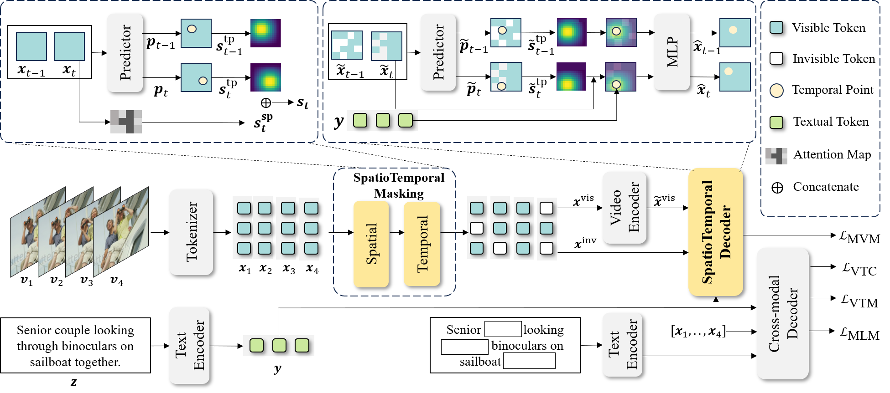

<<<<<<< HEAD
# Video Language Model Pretraining with Spatio-temporal Masking

[CVPR 2025] This is the official repository for our paper: "Video Language Model Pretraining with Spatio-temporal Masking".

By Yue Wu, Zhaobo Qi, Junshu Sun, Yaowei Wang, Qingming Huang and Shuhui Wang.

# Introduction

<p style="text-align:justify; text-justify:inter-ideograph;">
The development of self-supervised video-language models based on mask learning has significantly advanced downstream video tasks. These models leverage masked reconstruction to facilitate joint learning of visual and linguistic information. However, recent study reveals that reconstructing image features yields superior downstream performance compared to video feature reconstruction. We hypothesize that this performance gap stems from the way how masking strategies influence the model's attention to temporal dynamics. To validate this hypothesis, we performed two sets of experiments that demonstrate that alignment between the masked target and the reconstruction target is crucial for self-supervised video-language learning. Based on these findings, we propose a spatio-temporal masking strategy (STM) for video-language model pretraining that operates across adjacent frames, and a decoder leverages semantic information to enhance the spatio-temporal representations of masked tokens. Thanks to the combination of masking strategy and reconstruction decoder, STM enforces the model to learn spatio-temporal feature representation comprehensively. Experiments in three video understanding downstream tasks validate the superiority of our method.
</p>



# Installation

## Environment Setup

We mainly follow [VINDLU](https://github.com/klauscc/VindLU/) to prepare the enviroment.

```bash
# create 
conda env create -f vl.yml
# activate
conda activate vl
```

# Data Preparation

We mainly follow [UMT](https://github.com/OpenGVLab/unmasked_teacher/blob/main/multi_modality/DATASET.md) to prepare the data.

# Pre-Training
Train STM:
```
sh ./exp/pretraining/b16_5m.sh

```

# Zero-shot validation
Validate with pretrained model:
```
bash ./exp/zero_shot/ret_msrvtt/b16_25m.sh
```

# Finetuning

Validate with pretrained model:
```
sh ./exp/finetuning/ret_msrvtt/b16_5m.sh
```

# Cite

If you use our dataset or method in your research, please cite our paper:
```
@inproceedings{wu2025video,
  title={Video Language Model Pretraining with Spatio-temporal Masking},
  author={Wu, Yue and Qi, Zhaobo and Sun, Junshu and Wang, Yaowei and Huang, Qingming and Wang, Shuhui},
  booktitle={Proceedings of the Computer Vision and Pattern Recognition Conference},
  pages={8557--8567},
  year={2025}
}
```

# Acknowledgement
This repository is built based on [UMT](https://github.com/OpenGVLab/unmasked_teacher/tree/main/multi_modality) repository.
=======
# STM
[CVPR 2025] This is the official repository for our paper: "Video Language Model Pretraining with Spatio-temporal Masking".
>>>>>>> b6835fb14caad60a91d9b7f4982bcd6411d54e34
